# Stellar-Save — Rotational Savings on Stellar

**A decentralized rotational savings and credit association (ROSCA) built on Stellar Soroban smart contracts.**

Stellar Save is a traditional community-based savings system where members contribute a fixed amount regularly, and each member receives the total pool on a rotating basis. This project brings this time-tested financial mechanism to the blockchain, making it transparent, trustless, and accessible globally.

## 🎯 What is Stellar-Save?

Stellar-Save is a rotating savings and credit association (ROSCA) common in Nigeria and across Africa. Members:
- Form a group with a fixed contribution amount
- Contribute the same amount each cycle (e.g., weekly or monthly)
- Take turns receiving the full pool of contributions
- Build trust and financial discipline within communities

**This Soroban implementation makes Stellar-Save:**
- ✅ Trustless (no central coordinator needed)
- ✅ Transparent (all transactions on-chain)
- ✅ Accessible (anyone with a Stellar wallet can join)
- ✅ Programmable (automated payouts, no manual coordination)

## 🏗️ Architecture

The Stellar-Save system consists of four main layers that work together to provide a decentralized ROSCA experience:



### Architecture Components

- **User Layer**: Users interact with the system through Stellar wallets (Freighter, Lobstr, Albedo)
- **Frontend Layer**: React + TypeScript SPA with Vite, Material-UI components, and React Query for state management
- **Blockchain Layer**: Stellar network with Soroban smart contracts managing groups, contributions, and payouts
- **Data Layer**: On-chain storage, Stellar Horizon API for transaction history, and Soroban events for real-time updates

### Key Data Flows

1. **Group Creation**: User → Frontend → Contract → On-chain Storage → Events → UI Update
2. **Contribution**: User → Frontend → Contract → Escrow → Storage → Events → UI Update
3. **Payout**: User → Frontend → Contract → Escrow → Recipient → Storage → Events → UI Update

For detailed architecture documentation, see [docs/architecture.md](docs/architecture.md).

## 🚀 Features

- **Create Groups**: Set contribution amount, cycle duration, and max members
- **Join & Participate**: Members join and contribute each cycle
- **Automatic Payouts**: When all members contribute, payout executes automatically to the next recipient
- **Native XLM Support**: Built-in support for Stellar Lumens (XLM)
- **Token Ready**: Architecture supports custom Stellar tokens (roadmap item)
- **Transparent**: All contributions and payouts are verifiable on-chain

## 🛠️ Quick Start

### Prerequisites

- [Rust](https://www.rust-lang.org/tools/install) (1.70+)
- [Soroban CLI](https://soroban.stellar.org/docs/getting-started/setup)
- [Stellar CLI](https://developers.stellar.org/docs/tools/stellar-cli)

### Build

```bash
./scripts/build.sh
```

### Test

```bash
./scripts/test.sh
```

### Setup Environment

1. Copy the example environment file:
```bash
cp .env.example .env
```

2. Configure your environment variables in `.env`:
```bash
# Network configuration
STELLAR_NETWORK=testnet
STELLAR_RPC_URL=https://soroban-testnet.stellar.org

# Contract addresses (after deployment)
CONTRACT_GUESS_THE_NUMBER=<your-contract-id>
CONTRACT_FUNGIBLE_ALLOWLIST=<your-contract-id>
CONTRACT_NFT_ENUMERABLE=<your-contract-id>

# Frontend configuration
VITE_STELLAR_NETWORK=testnet
VITE_STELLAR_RPC_URL=https://soroban-testnet.stellar.org
```

3. Network configurations are defined in `environments.toml`:
   - `testnet` - Stellar testnet
   - `mainnet` - Stellar mainnet
   - `futurenet` - Stellar futurenet
   - `standalone` - Local development

### Deploy to Testnet

```bash
# Configure your testnet identity first
stellar keys generate deployer --network testnet

# Deploy
./scripts/deploy_testnet.sh
```

### Run Demo

Follow the step-by-step guide in [demo/demo-script.md](demo/demo-script.md)

## 📖 Documentation

- [Architecture Overview](docs/architecture.md)
- [Storage Layout](docs/storage-layout.md)
- [Threat Model & Security](docs/threat-model.md)
- [Roadmap](docs/roadmap.md)

## 🎓 Smart Contract API

### Group Management
```rust
create_group(contribution_amount, cycle_duration, max_members) -> u64
get_group(group_id) -> Group
list_members(group_id) -> Vec<Address>
```

### Membership
```rust
join_group(group_id)
is_member(group_id, address) -> bool
```

### Contributions
```rust
contribute(group_id, member, amount)
get_contribution_status(group_id, cycle_number) -> Vec<(Address, bool)>
```

### Payouts
```rust
execute_payout(group_id)
is_complete(group_id) -> bool
```

### Emergency Pause
```rust
pause_group(group_id, caller)    // Creator-only: halt contributions & payouts
unpause_group(group_id, caller)  // Creator-only: resume contributions & payouts
```

## 🧪 Testing

Comprehensive test suite covering:
- ✅ Group creation and configuration
- ✅ Member joining and validation
- ✅ Contribution flow and tracking
- ✅ Payout rotation and distribution
- ✅ Group completion lifecycle
- ✅ Emergency pause/unpause scenarios
- ✅ Error handling and edge cases

Run tests:
```bash
cargo test
```

## 🌍 Why This Matters

**Financial Inclusion**: Over 1.7 billion adults globally are unbanked. Ajo/Esusu has served African communities for generations as a trusted savings mechanism.

**Blockchain Benefits**:
- No need for a trusted coordinator
- Transparent contribution and payout history
- Programmable rules enforced by smart contracts
- Accessible to anyone with a Stellar wallet

**Target Users**:
- African diaspora communities
- Unbanked/underbanked populations
- Small business owners needing working capital
- Communities building financial discipline


## 🗺️ Roadmap

- **v1.0** (Current): XLM-only groups, basic functionality
- **v1.1**: Custom token support (USDC, EURC, etc.)
- **v2.0**: Flexible payout schedules, penalty mechanisms
- **v3.0**: Frontend UI with wallet integration
- **v4.0**: Mobile app, fiat on/off-ramps

See [docs/roadmap.md](docs/roadmap.md) for details.

## 🤝 Contributing

We welcome contributions! Please:
1. Fork the repository
2. Create a feature branch (`git checkout -b feature/amazing-feature`)
3. Commit your changes (`git commit -m 'Add amazing feature'`)
4. Push to the branch (`git push origin feature/amazing-feature`)
5. Open a Pull Request

See our [Code of Conduct](CODE_OF_CONDUCT.md) and [Contributing Guidelines](CONTRIBUTING.md).

### 🌊 Drips Wave Contributors

This project participates in **Drips Wave** - a contributor funding program! Check out:
- **[Wave Contributor Guide](docs/wave-guide.md)** - How to earn funding for contributions
- **[Wave-Ready Issues](docs/wave-ready-issues.md)** - 12 funded issues ready to tackle
- **GitHub Issues** labeled with `wave-ready` - Earn 100-200 points per issue

Issues are categorized as:
- `trivial` (100 points) - Documentation, simple tests, minor fixes
- `medium` (150 points) - Helper functions, validation logic, moderate features  
- `high` (200 points) - Core features, complex integrations, security enhancements

## 📄 License

This project is licensed under the MIT License - see the [LICENSE](LICENSE) file for details.

## 🙏 Acknowledgments

- Stellar Development Foundation for Soroban
- African communities that have practiced Ajo/Esusu for centuries
- Drips Wave for supporting public goods funding

## 📞 Contact

- **Issues**: [GitHub Issues](https://github.com/Xoulomon/Stellar-Save/issues)
- **Discussions**: [GitHub Discussions](https://github.com/Xoulomon/Stellar-Save/discussions)
- **Telegram**: [@Xoulomon]

---

**Built with ❤️ for financial inclusion on Stellar**
