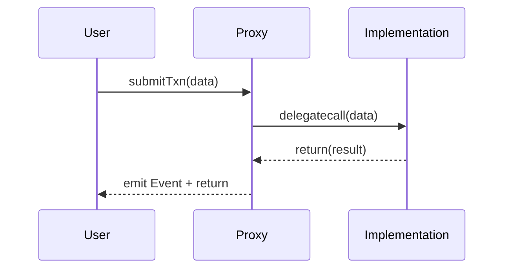

# API Reference

## 1. API Template
Use consistent NatSpec comments and clear parameter names.

### Example function: `mint`
```solidity
/// @notice Mint tokens to a recipient.
/// @param to Address receiving the tokens.
/// @param amount Amount of tokens to mint.
/// @return success True if minting succeeded.
function mint(address to, uint256 amount) external returns (bool success);
```

### Example function: `transfer`
```solidity
/// @notice Transfer tokens from caller to recipient.
/// @param to Recipient address.
/// @param amount Number of tokens to transfer.
/// @return success True on success.
function transfer(address to, uint256 amount) external returns (bool success);
```

### Example function: `burn`
```solidity
/// @notice Burn tokens from the caller.
/// @param amount Number of tokens to burn.
/// @return burnt Amount of tokens burned.
function burn(uint256 amount) external returns (uint256 burnt);
```

## 2. Standard Error Codes
- `Unauthorized()`
- `InsufficientBalance()`
- `TransferFailed()`
- `ZeroAddress()`
- `AmountExceedsAllowance()`
- `Paused()`
- `NotPaused()`
- `AlreadyInitialized()`
- `Overflow()`
- `ReentrancyGuard()`

## 3. Usage Example
```solidity
// SPDX-License-Identifier: MIT
pragma solidity ^0.8.0;

import "@openzeppelin/contracts/token/ERC20/IERC20.sol";

contract ExampleUsage {
    IERC20 public token;

    constructor(IERC20 _token) {
        token = _token;
    }

    function mintAndTransfer(address to, uint256 amount) external {
        // mint to this contract (requires minter role or internal allowance)
        bool success = IMyToken(address(token)).mint(address(this), amount);
        require(success, "Mint failed");

        // transfer to destination
        require(token.transfer(to, amount), "Transfer failed");
    }
}
```

## 4. Mermaid Sequence Diagram


## 5. Additional Notes
- Document all events and custom revert reasons.
- For upgradeable contracts, include function visibility and initializer patterns (`initializer`).
- Provide interface compatibility (IERC20, IERC721, ERC165) in reference docs.
